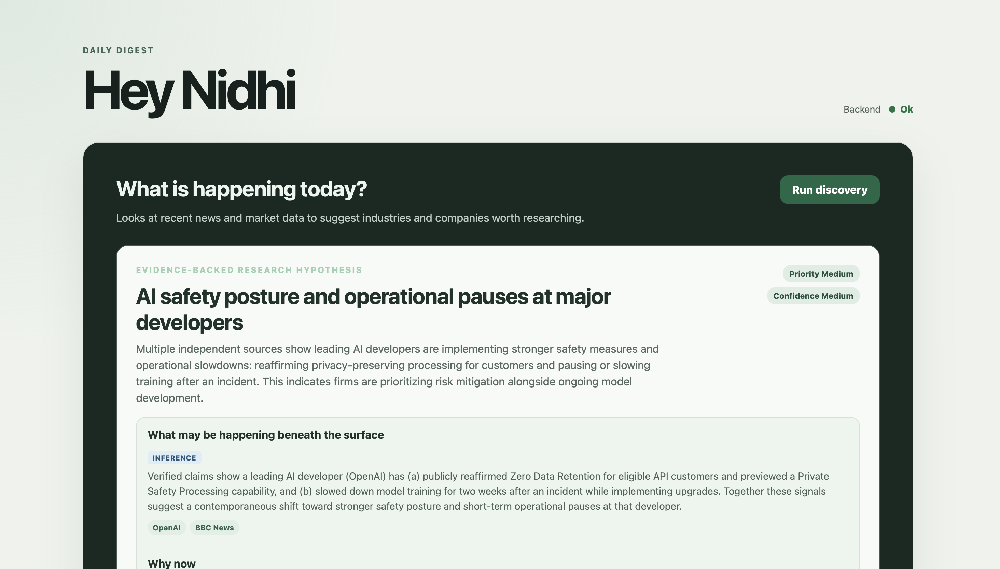
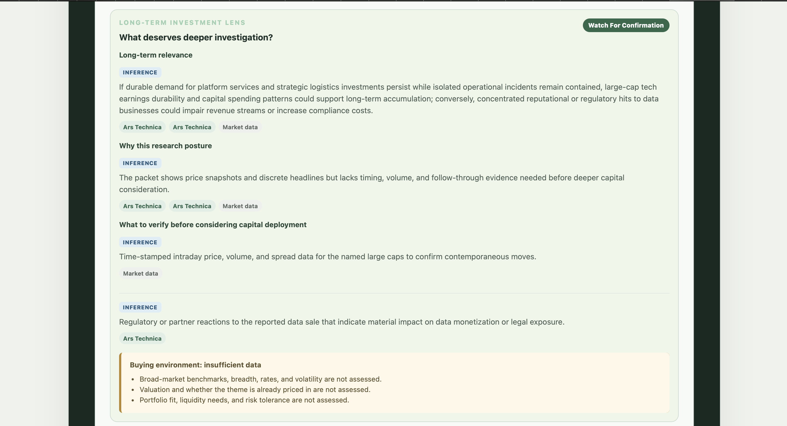
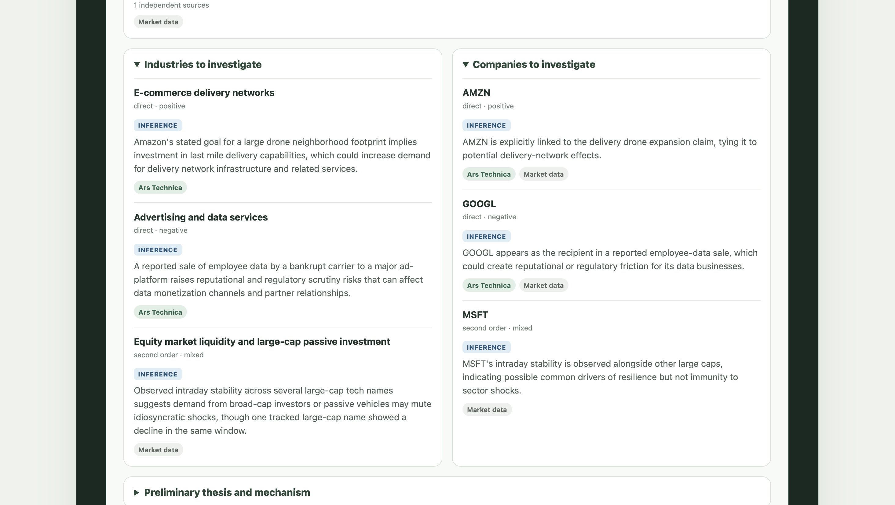
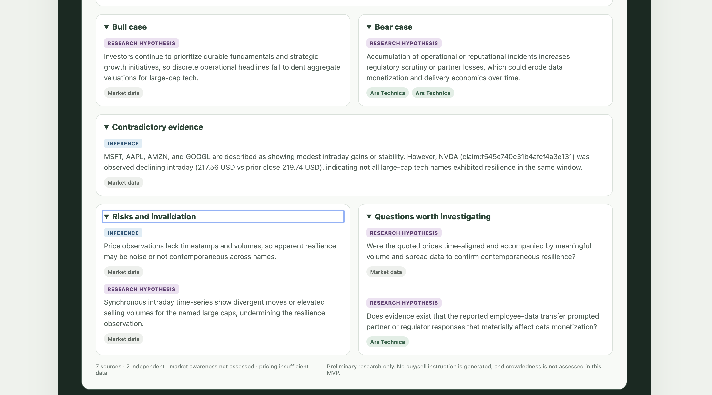

# Daily Digest

Daily Digest helps you understand what may be moving markets without
reading every story yourself. It looks for patterns across current information,
shows the evidence behind those patterns, and suggests industries, companies,
and questions worth researching.

The product is designed for long-term investment research. It does not tell you
what to buy or sell, predict prices, or place trades.

## Why I built it

I wanted a practical way to follow market-moving developments without turning
an LLM into a stock picker. The interesting engineering problem is not headline
summarization; it is finding a pattern across different sources, preserving the
evidence, and making every conclusion easy to challenge.

## Stack

| Layer | Technology |
| --- | --- |
| Frontend | React, TypeScript, and Vite |
| Backend | Python and FastAPI |
| Data | PostgreSQL, Alembic, and pgvector for a planned RAG milestone |
| AI | OpenAI structured outputs behind backend interfaces |
| Tooling | Docker Compose, pytest, Ruff, ESLint, and GitHub Actions |

## What the app does today

The dashboard has two main areas:

- **Market watchlist** — current price, daily change, previous close, and market
  status for configured companies.
- **Research Discovery** — an on-demand analysis that connects developments
  across independent sources and produces cited industry research leads.

A research opportunity explains:

- What pattern the system detected and why it may matter now
- Which industries and companies could be affected
- The strongest positive and skeptical interpretations
- Contradictory evidence, risks, and unanswered questions
- What evidence to watch next
- Confidence, limitations, and links to the underlying sources

Curated publisher feeds are used inside the research pipeline.

## How it works

When you start Research Discovery:

1. The API creates a durable job.
2. A background worker collects approved source and market data.
3. Deterministic code validates, deduplicates, and stores the data.
4. Focused AI steps extract claims, connect signals, challenge possible themes,
   and form a preliminary thesis.
5. The app publishes only conclusions that can be traced back to stored
   evidence.

    Sources -> Claims -> Signals -> Themes -> Evidence
            -> Research Thesis -> Research Opportunity

The browser calls only the FastAPI backend. Provider credentials and
third-party requests stay on the server.

> [!IMPORTANT]
> The current source set is intentionally limited. Results are research leads,
> not complete due diligence or personalized financial advice.

## Project status

| Area | Status |
| --- | --- |
| React dashboard and FastAPI API | Available |
| PostgreSQL-backed research jobs and provenance | Available |
| Configurable market watchlist | Available |
| Research Discovery with structured AI output | Available |
| Broad-market, rates, volatility, and valuation context | Next milestone |
| SEC filings, investor relations, and wider web research | Planned |
| Personal knowledge base with RAG | Planned |

See the [development roadmap](docs/roadmap.md) for milestone details.

## Run locally

### Prerequisites

- Python 3.9 or later
- Node.js 22.13 or later and npm
- Docker with Docker Compose

Run all commands from the repository root unless a step says otherwise.

### 1. Create local configuration

    cp .env.example .env
    cp frontend/.env.example frontend/.env.local

Edit **.env** and set:

- A local **POSTGRES_PASSWORD**
- **FINNHUB_API_KEY** for market data
- **OPENAI_API_KEY** for Research Discovery

These local files are ignored by Git. Never put secrets in a **VITE_** variable;
those values are visible in the browser.

### 2. Install dependencies

Backend:

    python3 -m venv .venv
    source .venv/bin/activate
    python -m pip install -e "./backend[dev]"

Frontend:

    cd frontend
    npm ci
    cd ..

### 3. Start PostgreSQL and apply migrations

    docker compose up -d db
    cd backend
    ../.venv/bin/alembic upgrade head
    cd ..

### 4. Start the application

Start each process in a separate terminal.

API:

    source .venv/bin/activate
    python -m uvicorn app.main:app --app-dir backend --reload

Research worker:

    cd backend
    ../.venv/bin/python -m app.workers.main

Frontend:

    cd frontend
    npm run dev

Open <http://127.0.0.1:5173>. The API documentation is available at
<http://127.0.0.1:8000/docs>.

To verify the API and database connection:

    curl http://127.0.0.1:8000/api/health

## Run checks

Backend:

    cd backend
    ../.venv/bin/ruff check .
    ../.venv/bin/ruff format --check .
    RUN_DATABASE_TESTS=1 ../.venv/bin/python -m pytest
    ../.venv/bin/alembic check

Frontend:

    cd frontend
    npm run lint
    npm run typecheck
    npm run build

## Repository map

    frontend/                 React, TypeScript, and Vite
    backend/app/api/          FastAPI routes
    backend/app/ai/           AI contracts, prompts, and provider adapter
    backend/app/domain/       Provider-independent domain models
    backend/app/providers/    External source and market adapters
    backend/app/repositories/ PostgreSQL persistence
    backend/app/services/     Application orchestration
    backend/app/workers/      Durable background jobs
    backend/migrations/       Alembic migrations
    backend/tests/            Backend test suite
    docs/                     Product and technical documentation

## Documentation guide

Read these pages in order if you are new to the project:

1. [Product](docs/product.md) — who the product is for and what it promises.
2. [Architecture](docs/architecture.md) — how the running system fits together.
3. [Research system](docs/research-system.md) — how evidence becomes a research
   opportunity.
4. [AI architecture](docs/ai-architecture.md) — where AI is used and constrained.
5. [Roadmap](docs/roadmap.md) — what is available, next, and planned.

Reference pages:

- [RAG design](docs/rag.md) — planned persistent-knowledge retrieval.
- [Testing and evaluation](docs/evaluation.md) — quality gates and evaluation.
- [Codex instructions](AGENTS.md) — concise rules for future coding sessions.
